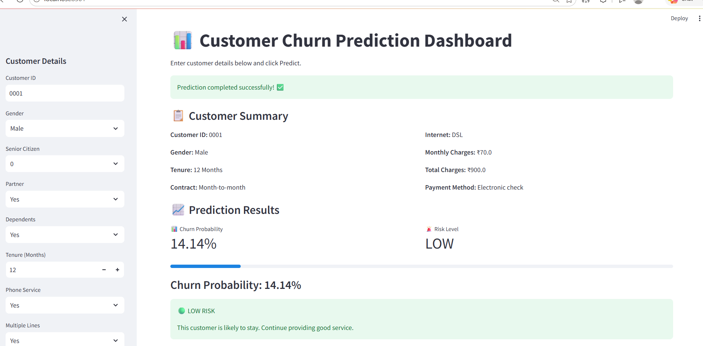
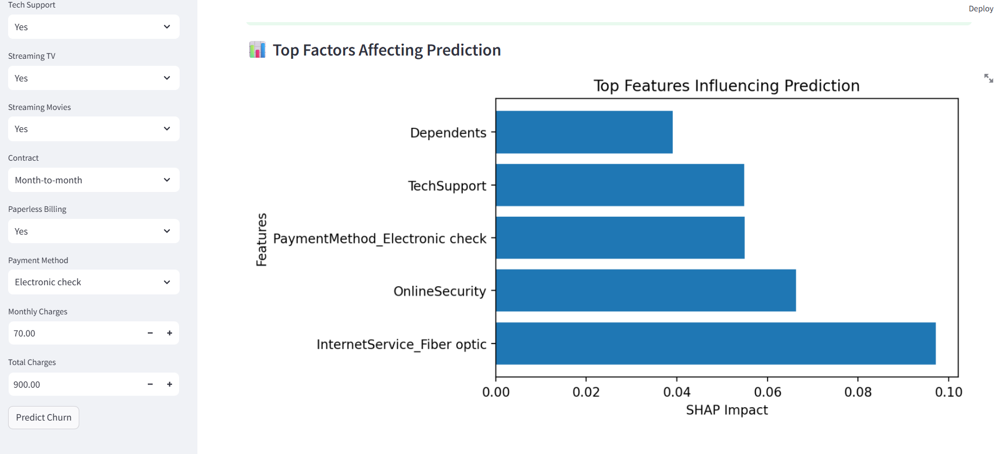
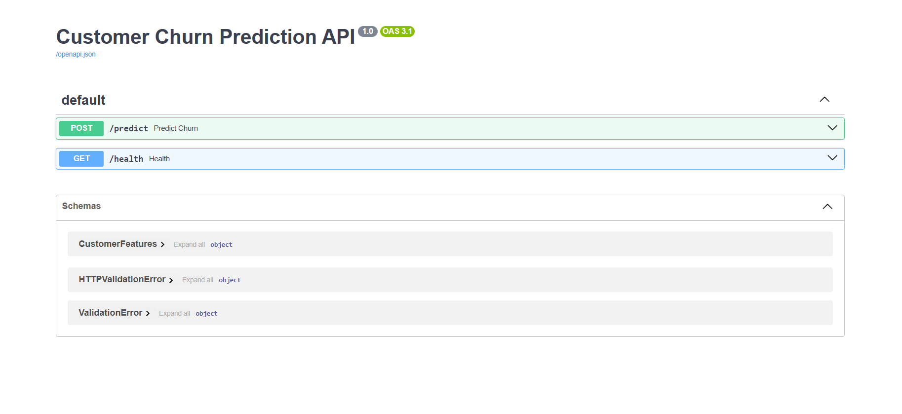

# 📊 Customer Churn Prediction & Retention Intelligence System

An end-to-end Machine Learning project that predicts customer churn using customer demographics, contract details, and service usage. The project includes data preprocessing, feature engineering, model training, explainable AI using SHAP, a FastAPI backend, and an interactive Streamlit dashboard.

---

## 🚀 Project Overview

Customer churn is one of the biggest challenges faced by telecom companies. Losing existing customers directly affects business revenue.

This project predicts whether a customer is likely to churn and provides an explanation of the prediction using SHAP values. The application also offers an interactive dashboard for business users.

---

## ✨ Features

- 📊 Exploratory Data Analysis (EDA)
- 🧹 Data Cleaning & Preprocessing
- ⚙️ Feature Engineering
- 🤖 Machine Learning Model Training
- 📈 Model Evaluation
- 🔍 SHAP Explainability
- 💾 Model Serialization using Joblib
- 🚀 FastAPI REST API
- 🎨 Interactive Streamlit Dashboard
- 📉 Churn Probability Prediction
- 🚦 Risk Level Classification
- 📋 Customer Summary
- 📊 Feature Importance Visualization

---

## 🛠️ Tech Stack

### Programming Language
- Python

### Libraries
- Pandas
- NumPy
- Scikit-learn
- XGBoost
- SHAP
- Matplotlib
- Joblib

### Backend
- FastAPI
- Uvicorn

### Frontend
- Streamlit

### Tools
- Jupyter Notebook
- Git
- GitHub

---

## 📂 Project Structure

```
customer-churn-prediction/
│
├── dashboard/
│   └── app.py
│
├── data/
│   ├── raw/
│   └── eda_churn_dist.png
│
├── models/
│   └── random_forest_churn.pkl
│
├── notebooks/
│   ├── 01_eda.ipynb
│   └── 03_modeling.ipynb
│
├── src/
│   ├── api.py
│   ├── predict.py
│   ├── feature_engineering.py
│   └── __init__.py
│
├── requirements.txt
├── README.md
└── .gitignore
```

---

## 🔄 Workflow

```
Raw Dataset
      │
      ▼
Data Cleaning
      │
      ▼
Feature Engineering
      │
      ▼
EDA
      │
      ▼
Model Training
      │
      ▼
Model Evaluation
      │
      ▼
SHAP Explainability
      │
      ▼
Save Model
      │
      ▼
FastAPI Backend
      │
      ▼
Streamlit Dashboard
```

---

## 📊 Machine Learning Models

The following models were trained and compared:

- Logistic Regression
- Random Forest Classifier
- XGBoost Classifier

Random Forest achieved the best overall performance and was selected as the final model.

---

## 📈 Model Evaluation Metrics

- ROC-AUC Score
- Precision
- Recall
- F1 Score

---

## 🔍 Explainable AI

This project uses **SHAP (SHapley Additive Explanations)** to explain predictions.

SHAP identifies the features that contributed most to each prediction, making the model transparent and easier to interpret.

---

## 🌐 REST API

FastAPI provides prediction endpoints.

### Health Check

```
GET /health
```

### Predict Customer Churn

```
POST /predict
```

Input:

```json
{
  "customerID": "0001",
  "gender": "Male",
  "SeniorCitizen": 0,
  "Partner": "Yes",
  "Dependents": "No",
  "tenure": 12,
  "PhoneService": "Yes",
  "MultipleLines": "Yes",
  "InternetService": "Fiber optic",
  "OnlineSecurity": "No",
  "OnlineBackup": "Yes",
  "DeviceProtection": "No",
  "TechSupport": "No",
  "StreamingTV": "Yes",
  "StreamingMovies": "Yes",
  "Contract": "Month-to-month",
  "PaperlessBilling": "Yes",
  "PaymentMethod": "Electronic check",
  "MonthlyCharges": 75.5,
  "TotalCharges": 906.0
}
```

Example Output:

```json
{
  "churn_probability": 0.3046,
  "risk_level": "LOW",
  "top_reasons": [
    {
      "feature": "InternetService_Fiber optic",
      "impact": -0.1212
    }
  ]
}
```

---

## 🎨 Streamlit Dashboard

The dashboard allows users to:

- Enter customer details
- Predict churn probability
- View customer risk level
- Display SHAP feature importance
- View customer summary

---

## 📸 Screenshots

## 📸 Dashboard




---

## 🚀 FastAPI Documentation



---


---

## ⚙️ Installation

Clone the repository

```bash
git clone https://github.com/SindhooraRai/customer-churn-prediction.git
```

Go to project directory

```bash
cd customer-churn-prediction
```

Create virtual environment

```bash
python -m venv venv
```

Activate environment

Windows

```bash
venv\Scripts\activate
```

Install dependencies

```bash
pip install -r requirements.txt
```

Run FastAPI

```bash
uvicorn src.api:app --reload
```

Run Streamlit

```bash
streamlit run dashboard/app.py
```

---

## 🎯 Future Improvements

- Docker containerization
- CI/CD pipeline using GitHub Actions
- Cloud deployment
- User authentication
- Database integration
- Model monitoring
- Automated retraining pipeline

---

## 👩‍💻 Author

**Sindhoora Rai**

Electronics & Communication Engineering

Machine Learning | Data Science | Python | FastAPI | Streamlit

GitHub: https://github.com/SindhooraRai

---

## ⭐ If you found this project useful, consider giving it a star.